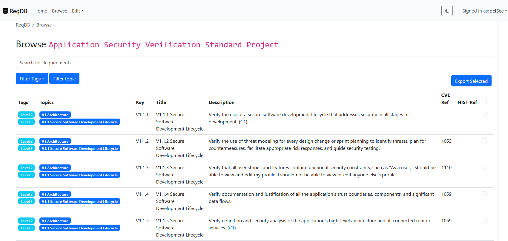
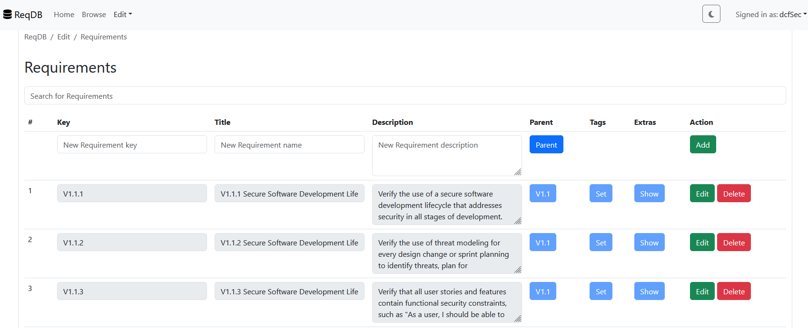

# ReqDB
ReqDB is a lightweight web application for managing requirements. ReqDB helps to efficiently manage, edit and view requirement catalogues.

ReqDB is built in Flask and React. Authentication and Authorization is done via oauth and Azure Entra is currenctly supported as IDP.

Each *requirement* is the children of a *topic*. A *topic* can have again a *topic* as a parent. For viewing the *requirements* the *topics* are bundled into *cataloges*. For filtering and *tags* are available. *Tags* can be assigned to any *requirement*. *Requirements* can have *extraFields*

The selected requirements can be exported as (currently) an excel file.

## Screenshots

### Browse Catalgue



### Browse Catalgue



## Installation

###  Backend

```
pip install -r requirements.tx
```

### Frontend

```
cd front-end
npm run build
```

## Configuration

The base configuration is done  via environment variables:

```
FLASK_APP="ReqDB"           # Name of the Flask app
FLASK_ENV="production"      # Flask environment  production or development
SECRET_KEY="CHANGEME"       # The secret key for flaks

DATABASE_URI="app.sqlite"   # Database URI for sqlalchemie (See https://docs.sqlalchemy.org/en/20/core/engines.html for details)

OAUTH_APP_CLIENT_ID="xxx"   # Client ID for oauth (Azure Entra)
OAUTH_APP_TENANT="xxx"      # Azure Tenant ID

RESOURCE_GROUP_NAME="ReqDB"  # Resource group for zip deployment with deployZip.sh
APP_SERVICE_NAME="ReqDB"     # App Service for zip deployment with deployZip.sh

VITE_APP_CLIENT_ID = "xxx"  # Client ID for oauth (Azure Entra) (React)
VITE_APP_TENANT = "xxx"     # Azure Tenant ID (React)

```

## Azure Entra Configuration

The application in Azure Entra needs to be configured to allow users to access it. The configuration below is the needed configuration (The section headers are the config menues in the Azure Portal)

### API Permissions

* `User.Read` -> Get the e-Mail to display in the upper corner

### Expose an API

* `api://<APP-ID>/ReqDB.Reader` -> Read access to the API
* `api://<APP-ID>/ReqDB.Writer` -> Write access to the API

### App Roles

* `Reader` -> Read access to the front-end
* `Writer` -> Write access to the front-end

## Deployment

ReqDB can be deployed everywhere where python is supported as runtime environment. `deployZip.sh`  is a simple deployment script to deploy the app to an Azure App Service.

## Development

1. Clone the repository: `git clone git@github.com:dcfSec/ReqDB.git; cd ReqDB`
2. Install the backend requirements: `pip install -r requirements.tx`
3. Start the backend: `flask run flask --app app run`
4. Install the frontend requirements: `cd front-end; npm install`
5. Start the frontend for development `npm run start`

## Versioning

We use [SemVer](http://semver.org/) for versioning. For the versions available, see the [tags on this repository](https://github.com/dcfSec/ReqDB/tags). 

## Authors

 * [dcfSec](https://github.com/dcfSec) - *Initial work*

See also the list of [contributors](https://github.com/dcfSec/REqDB/contributors) who participated in this project.

## License

This project is licensed under the Apache 2.0 License - see the [LICENSE](LICENSE) file for details