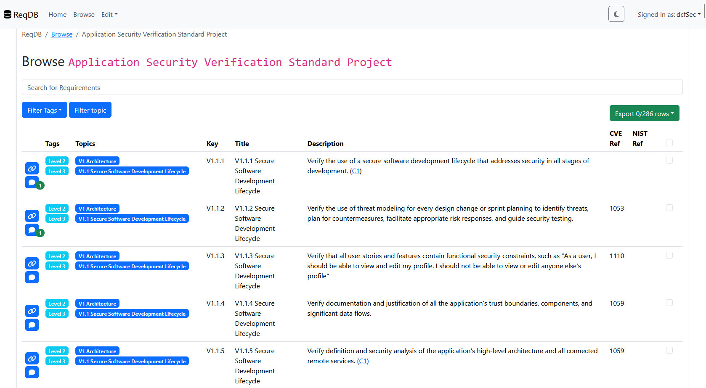

# ReqDB
ReqDB is a lightweight web application for managing requirements. ReqDB helps to efficiently manage, edit and view requirement catalogues.

ReqDB is built in Flask and React. Authentication and Authorization is done via oauth and Azure Entra is currently supported as IDP.

Each *requirement* is the children of a *topic*. A *topic* can have again a *topic* as a parent. For viewing the *requirements* the *topics* are bundled into *catalogues*. For filtering and *tags* are available. *Tags* can be assigned to any *requirement*. *Requirements* can have *extraFields*

When a user has the `Comments.Writer` they can add comments to requirements in the browse view.

The selected requirements can be exported as (currently) an excel, json or yaml file.

If you want to access and use the API programmatically you can use the official API client: [ReqDB-PyClient](https://github.com/dcfSec/ReqDB-PyClient)

To kickstart the ReqDB you can use the [ReqDBContentCreator](https://github.com/dcfSec/ReqDBContentCreator) to add public standards to ReqDB.

## Screenshots

### Browse Catalogue



### Browse Catalogue


## Deployment

ReqDB is a FastAPI plus React application with any database in the background which is [supported by sqlalchemy](https://docs.sqlalchemy.org/en/20/core/engines.html).
Using ReqDB can be as simple as deploying it locally with a sqlite DB or as a web service with a e.g. postgres DB.

### Manual

ReqDB can be deployed everywhere where python is supported as runtime environment.

#### Install and Build

```sh
pip install -r requirements.txt

cd spa
npm install
npm run build
```

#### Run

```sh
python3.13 app.py
```

_The app was tested with python3.13_

### Docker

ReqDB can be deployed with our docker image. The image is available at [docker hub (dcfsec/reqdb)](https://hub.docker.com/r/dcfsec/reqdb):

* Pull: `docker pull dcfsec/reqdb`
* Run: `docker run dcfsec/reqdb --env-file ./.env -p 8000:8000` (Use the `template.env` as a template for the environment variable file)


## Configuration

### Base Configuration

The base configuration is done via environment variables:

```sh
SESSION_SECRET_KEY=xxx             # The secret key for Flask
                                   # See https://flask.palletsprojects.com/en/stable/config/#SECRET_KEY for details

DATABASE_URI=sqlite:///app.sqlite  # Database URI for sqlalchemy
                                   # See https://docs.sqlalchemy.org/en/20/core/engines.html for details

OAUTH_PROVIDER=xxx                 # Used oauth provider in human readable way (E.g. Entra ID or Octa).
                                   # This will be displayed as login button description
OAUTH_CLIENT_ID=xxx                # Client ID for oauth
OAUTH_CLIENT_SECRET=xxx            # Client Secret for oauth
OAUTH_CONFIG=xxx                   # OAuth config URL (something like <AUTHORITY>/.well-known/openid-configuration)

REDIS_HOST=xxx                     # Redis host for session sync
REDIS_PORT=6379                    # Redis port for session sync
REDIS_PASSWORD=xxx                 # Redis password for session sync

USE_UVICORN_WORKERS=-1             # Use this if you want to use workers for uvicorn (-1 uses the max available workers) Don't set this if you don't want to use workers   

BASE_URL=http://localhost          # The base URL for ReqDB (Used in Notifications for the link). Defaults to http://localhost
EMAIL_HOST=xxx                     # SMTP server for sending mails. If EMAIL_HOST is not set mail sending will be disabled 
EMAIL_PORT=587                     # Port for the smtp server. Defaults to 587
EMAIL_USER=xxx                     # User for logging into the SMTP server. Can be unset
EMAIL_PASSWORD=xxx                 # Password for the SMTP server. Can be unset
EMAIL_FROM=xxx                     # Mail address (from) for sending notifications. If EMAIL_FROM is not set mail sending will be disabled 
EMAIL_TLS=1                        # Flag to use STARTTLS for the SMTP server. Defaults to 1
```

## OAuth Server Configuration

### Token configuration

ReqDB accesses some user identifiers from OAuth claims. Following claims are needed:

| Claim   | Reason                                                                                                                                                                   |
|---------|--------------------------------------------------------------------------------------------------------------------------------------------------------------------------|
| `email` | Used for displaying the logged in user in the front end and send it to the back end for human readable identification JWTs `sub` is used as primary identifier for users |


### Scopes

To get our claim and roles for ReqDB we request the needed scopes from the oidc server:

* `email`
* `openid`
* `<OAUTH_CLIENT_ID>/.default`


### App Roles

ReqDB defines following roles:

| Role                   | Description                                             |
|------------------------|---------------------------------------------------------|
| `Requirements.Reader`  | Read access to the requirements API                     |
| `Requirements.Writer`  | Write access to the requirements API                    |
| `Requirements.Auditor` | Read access to view the requirement audit log API       |
| `Comments.Reader`      | Read access to the comment API                          |
| `Comments.Writer`      | Write (add) access to the comment API                   |
| `Comments.Moderator`   | Write (edit, delete) access to the comment API          |
| `Comments.Auditor`     | Read access to view the comment audit log API           |
| `Configuration.Reader` | Read access to the configuration API                     |
| `Configuration.Writer` | Write access to the configuration API                    |


### Redirect URL

The application uses `https://<YOUR_FQDN>/auth/callback` and `https://<YOUR_FQDN>/auth/SPACallback` as redirect URLs for the web app and `http://localhost` is needed if you use the python client.

### Azure Entra Configuration

The configuration for Entra ID is of course special. To get a proper access token the applications manifest needs to be edited: Go to `Manifest` and set `requestedAccessTokenVersion` to `2`.

Also in `Token configuration` the `email` claim needs to be set for `ID` and `Access`.

Lastly in in `API permissions` the permissions `email`, `openid` and `profile` needs to be set.

## Development

1. Clone the repository: `git clone git@github.com:dcfSec/ReqDB.git; cd ReqDB`
2. Install the backend requirements: `poetry install --no-root` (`poetry` is used to manage the dependencies for development)
3. Start the backend: `fastapi dev app.py`
4. Install the frontend requirements: `cd spa; npm install`
5. Start the frontend for development `npm run start`

## Versioning

We use [SemVer](http://semver.org/) for versioning. For the versions available, see the [tags on this repository](https://github.com/dcfSec/ReqDB/tags). 

## Authors

 * [dcfSec](https://github.com/dcfSec) - *Initial work*

See also the list of [contributors](https://github.com/dcfSec/ReqDB/contributors) who participated in this project.

## License

This project is licensed under the Apache 2.0 License - see the [LICENSE](LICENSE) file for details